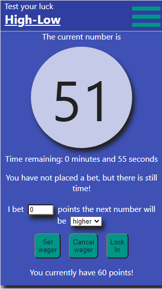

# High-Low

## Summary
High-Low is a lightweight game where users place wagers to earn points.  A randomly generated number between 1 and 100 inclusive are displayed and users bet on the next number being either higher or lower.  Successful wagers accrue points while points are deducted for incorrect guesses.  User are able to sign up for an account to save their progress between sessions.

## Live link
[https://high-low.now.sh/](https://high-low.now.sh/)
To demo the application you can log in with the user name 'TestUser' and password 'D4m0Pass!'

Client repo: [https://github.com/KevinPMoore/High-Low-Client](https://github.com/KevinPMoore/High-Low-Client) 
API repo: [https://github.com/KevinPMoore/High-Low-Server](https://github.com/KevinPMoore/High-Low-Server)

## Screenshots
Screenshots taken from the mobile client.

### Landing Page

### Login Page

### Game Page

### Account Page

## API documentation
### GET api/users
Returns a list of all users.  An example user is below.

### POST api/users
Adds a user to the database.  The 'user_name' and 'password' keys are required while bank and admin are set to 100 and false by default.  The password is hashed on insertion into the database.

### GET api/users/:user_id
Returns the user with the 'user_id' in the search parameter.  This requires an authorized bearer token.

### PATCH api/users/:user_id
Changes the user with the 'user_id' in the search parameter.  This is only used in the client to update the 'bank' key.  This requires an authorized bearer token.

### DELETE api/users/:user_id
Removes the user with the 'user_id' in the search parameter from the database.  This requires an authorized bearer token.

### POST api/auth/login
Generates an authToken and user object when provided with valid login credentials.  These are used to access protected endpoints.  An example is below.

## Technologies used
The front end of this project was built using React and styled with vanilla CSS.
The back end was built with Node and Express while the database uses Postgresql.  The database is connected to the API through the use of Knex.
This project was bootstrapped with [Create React App](https://github.com/facebook/create-react-app).